# Lost and Found Management System

A robust desktop application for managing lost and found items, built with **Java** and **JavaFX** for the interface, utilizing **SQLite** or **PostgreSQL** for efficient data management.

## Features

- User authentication with secure login
- Record management for lost and found items
- Return tracking and status updates
- Image support with automatic compression
- Statistics dashboard and reports
- Export to Excel, CSV, and PDF formats
- Automatic database backups
- Web dashboard for remote monitoring
- QR code generation for public record access

## 📸 Application Showcase

### 🔐 Authentication & Security
Access is protected by a professional login system ensuring data integrity and user accountability.

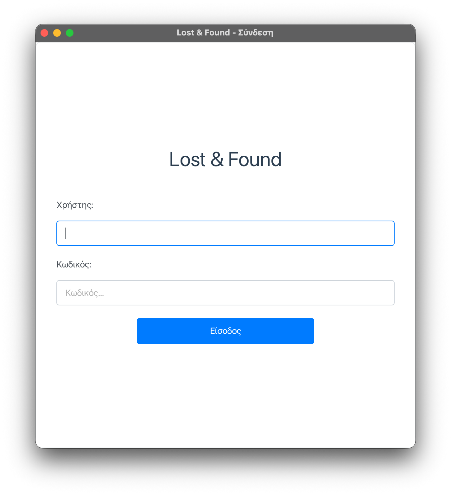
*Professional authentication interface with secure credential management.*

---

### 📦 Records & Item Management
A streamlined interface for tracking, processing, and managing all lost and found items.

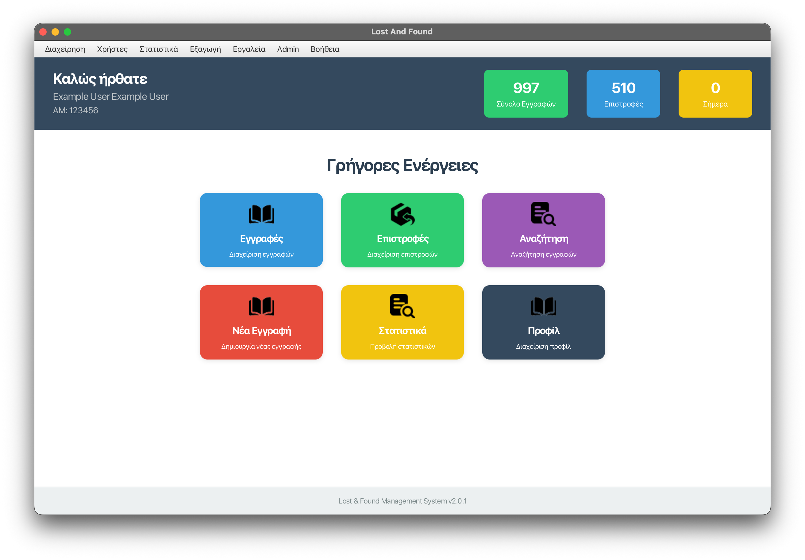
*Centralized dashboard providing an overview of all active and resolved records.*

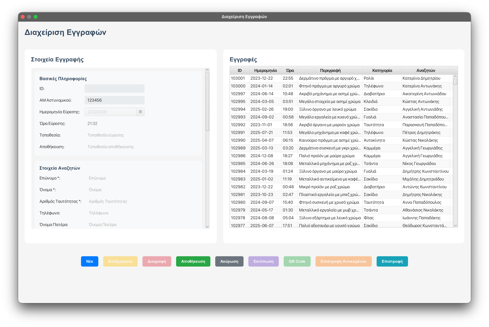
*Detailed record management interface for adding and editing item information.*

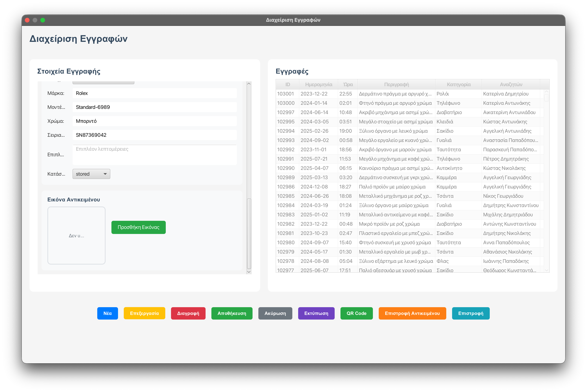
*Comprehensive view for large-scale record tracking and filtering.*

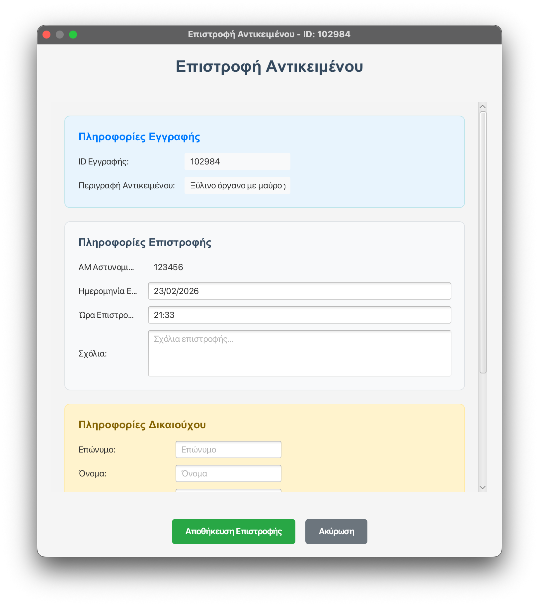
*Automated workflow for processing item returns with digital verification.*

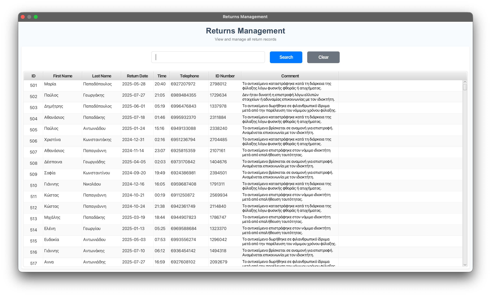
*Historical log of all processed returns for audit and tracking purposes.*

---

### 🔍 Search & Data Synchronization
Advanced lookup capabilities with seamless integration across SQLite and PostgreSQL environments.

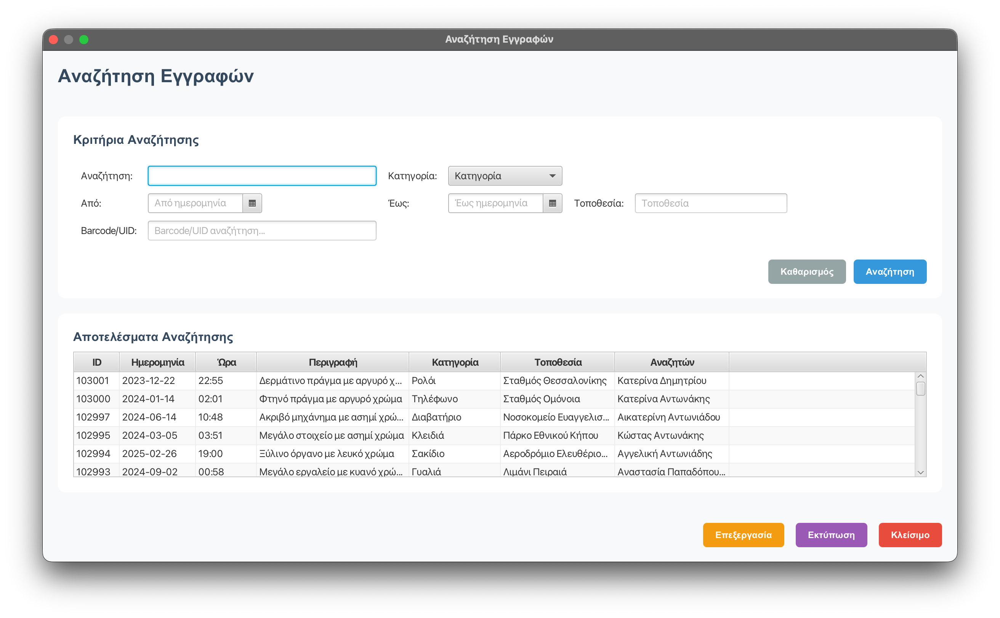
*Sophisticated filtering and search engine for rapid item discovery within the database.*

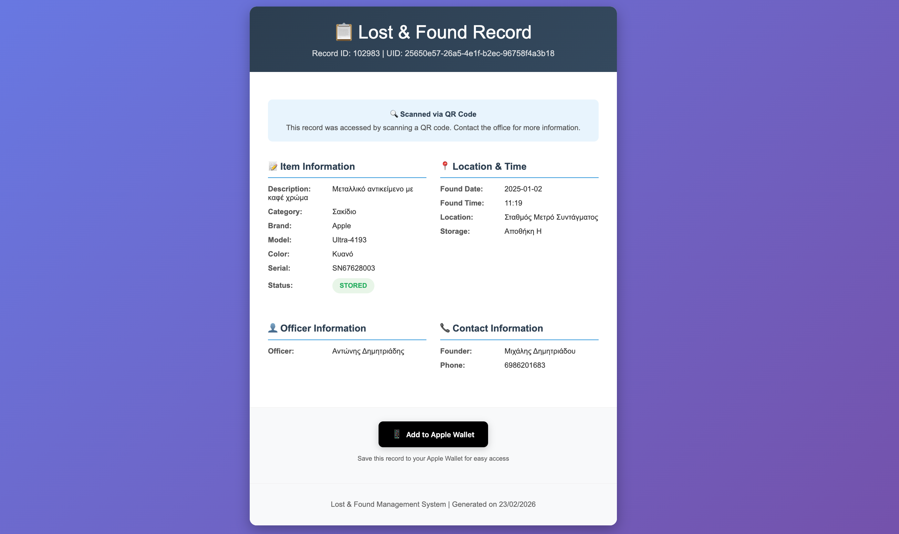
*Public-facing interface allowing users who have lost an item to view and claim their records via unique shareable links.*

---

### 📊 Analytics & Impact Reports
Comprehensive reporting module providing deep insights into system performance and item recovery rates.


*Visual overview of system performance and item processing metrics.*

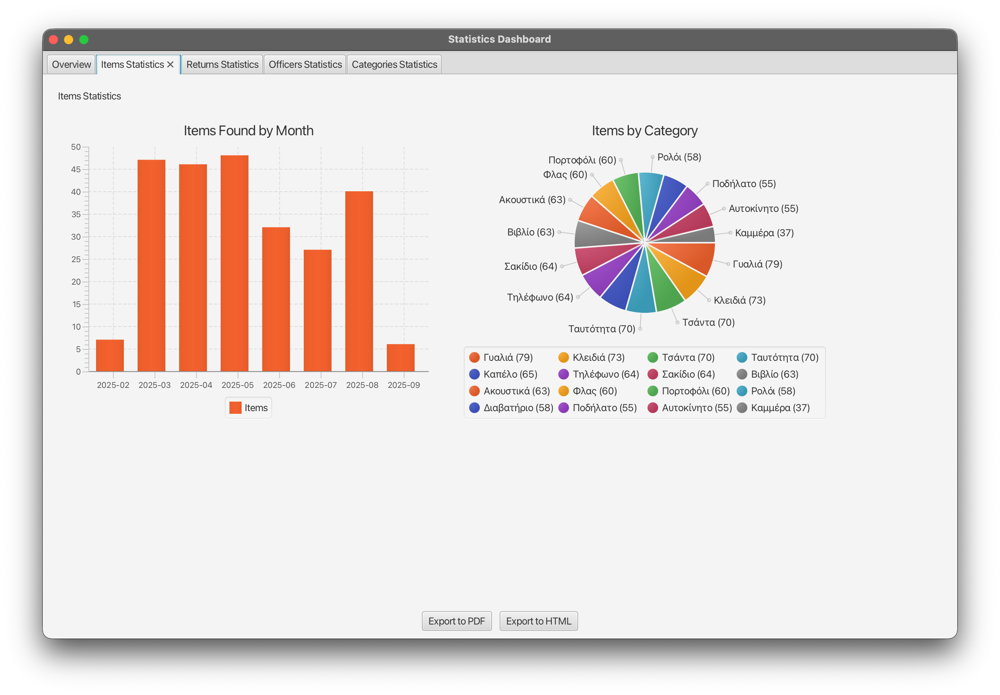
*Detailed analysis of lost and found trends over specific time periods.*

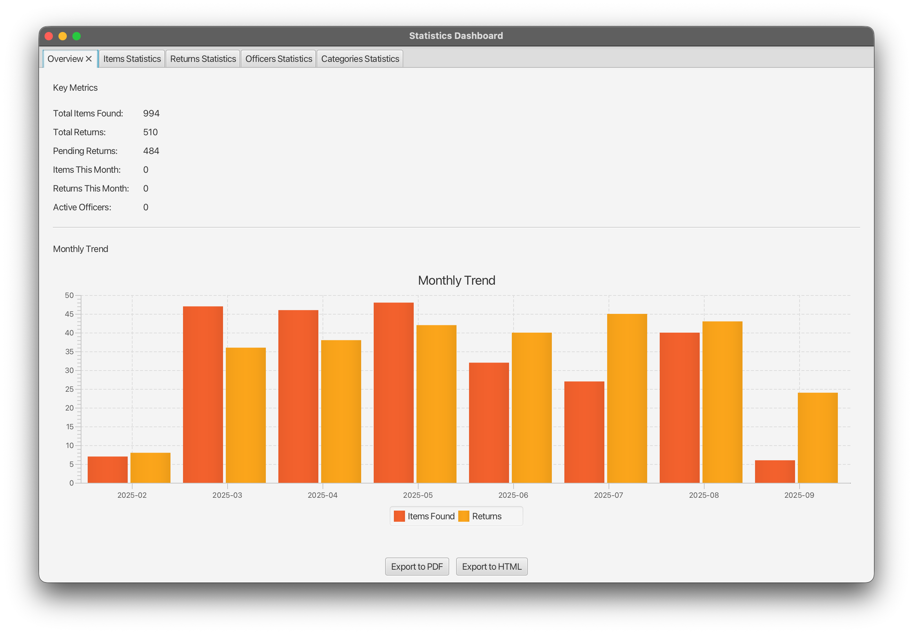
*Categorical distribution reports for item types and recovery status.*

---

### 🛠 Administration & System Control
Comprehensive tools for user management, server configuration, and mission-critical backups.

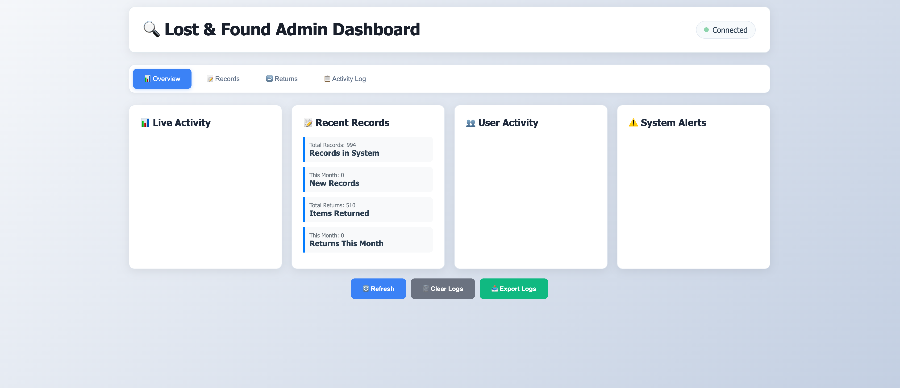
*Technical command center for system administrators.*

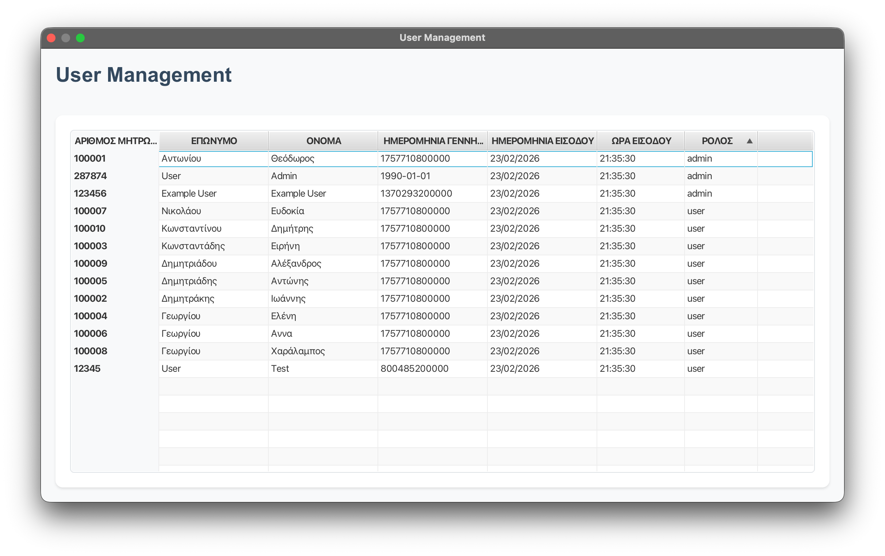
*Administrative interface for managing system users and roles.*

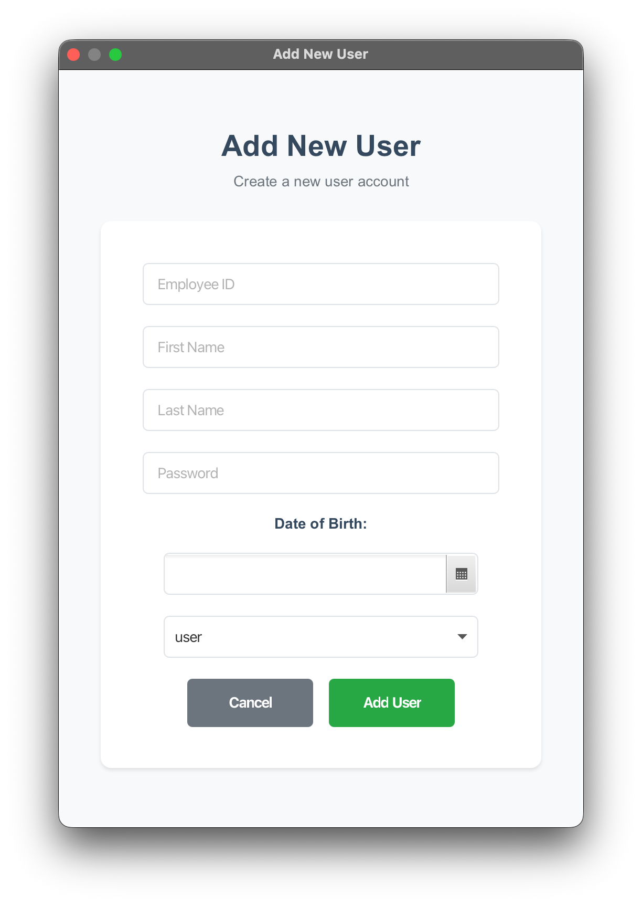
*Simplified provisioning for new administrative and staff accounts.*

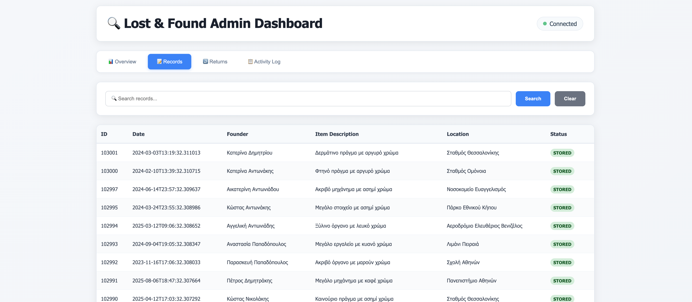
*Real-time monitoring of the web server status and connected clients.*

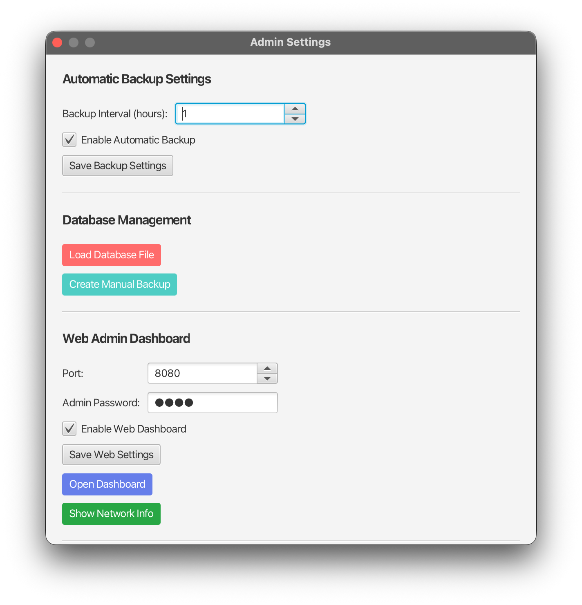
*Unified control panel for web server orchestration and automated database redundancy.*

## Requirements

- Java 11 or higher
- Maven 3.6 or higher

## Installation

1. Clone the repository
2. Build the application:
   ```bash
   mvn clean compile
   ```
3. Run the application:
   ```bash
   mvn javafx:run
   ```

## Default Login

- Username: `123456`
- Password: `123456`

## Usage

### Main Features
- Add new records with item details and photos
- Search and filter records
- Process item returns
- View statistics and reports
- Export data in multiple formats

### Web Dashboard
Access at `http://localhost:8080/admin`
- Username: `admin`
- Password: `admin123`

### QR Code Access
Records can be accessed publicly via QR codes at `http://localhost:8080/public/record/{uid}`

## Remote Access Setup

### Port Forwarding Configuration

To access the web dashboard from outside your local network, configure port forwarding on your router:

#### Step 1: Find Your Router's IP Address
- Windows: Open Command Prompt and run `ipconfig`
- Mac/Linux: Open Terminal and run `ifconfig` or `ip route`
- Look for "Default Gateway" (usually 192.168.1.1 or 192.168.0.1)

#### Step 2: Access Router Admin Panel
1. Open web browser and go to your router's IP address
2. Login with admin credentials (check router label or manual)
3. Common default credentials:
   - Username: `admin`, Password: `admin`
   - Username: `admin`, Password: `password`
   - Username: `admin`, Password: (blank)

#### Step 3: Configure Port Forwarding
1. Navigate to "Port Forwarding" or "Virtual Server" section
2. Create new port forwarding rule:
   - **Service Name**: Lost and Found
   - **External Port**: 8080
   - **Internal Port**: 8080
   - **Protocol**: TCP
   - **Internal IP**: Your computer's local IP address
3. Save and apply settings

#### Step 4: Find Your Public IP
- Visit `whatismyip.com` to get your public IP address
- Access the application using: `http://YOUR_PUBLIC_IP:8080/admin`

#### Common Router Brands
- **Netgear**: Advanced > Port Forwarding
- **Linksys**: Smart Wi-Fi Tools > Port Forwarding
- **TP-Link**: Advanced > NAT Forwarding > Port Forwarding
- **ASUS**: Advanced Settings > WAN > Virtual Server
- **D-Link**: Advanced > Port Forwarding

#### Troubleshooting
- Ensure Windows Firewall allows port 8080
- Check if your ISP blocks port 8080
- Try different external port (8081, 8082, etc.)
- Restart router after configuration

## Database

Uses SQLite database stored in `./lostAndFound.db`

## Configuration

- Database: `./lostAndFound.db`
- Images: `Desktop/export_data/images/`
- Backups: `data/backups/`
- Web server: Port 8080

## Building

Create executable JAR:
```bash
mvn clean package
```

## Support

For issues or questions, check the application logs or create an issue in the repository.

## Version 2.0.1

- Modern UI design
- Web dashboard
- QR code functionality
- Image management
- Automatic backups
- Export capabilities